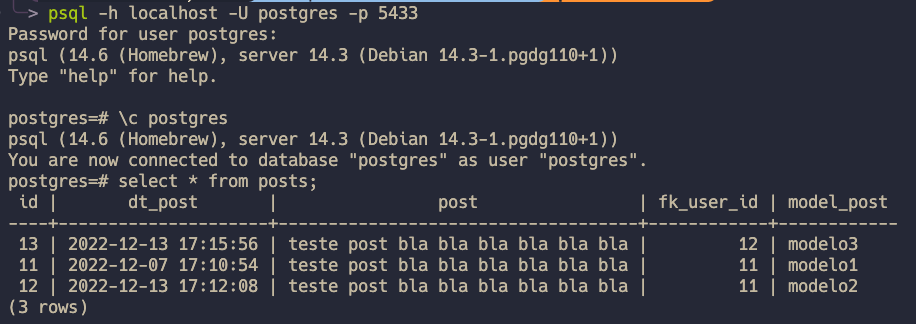

# backend-falae
## Clonando o projeto

Execute o comando abaixo no terminal:

```
git clone hhttps://github.com/thaisperlho/backend-falae.git
```
## Docker
---

__Criando a imagem Docker do banco Postgres__

O seguinte aquivo:
- [Dockerfile](Dockerfile)

Para realizarmos o build desse arquivo e criar a imagen:

```
docker build -t img-falae .
```

Logo em seguida inicializaremos um container da imagem gerada:

```
docker container run -d --rm -p 5433:5432 --name test_falae_db img-falae
```

Pronto! temos uma banco com dados que podemos utilizar para testar a aplicação.

Para fazer um teste podemos verificar no client do Postgres que o banco foi criado e inicializado:

```
psql -h localhost -U postgres -p 5433  
```
Saída do select na tabela posts:



## __Informações importantes para conexão com o banco de dados__

```
url=jdbc:postgresql://localhost:5433/postgres
username=postgres
password=1234
```


Usuarios existentes para teste:

```json
    "email": "teste@email"
    "senha": "@senha"

    "email": "teste2@email"
    "senha": "@senha2"
```


